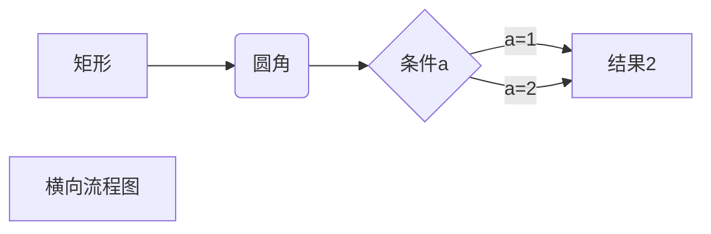
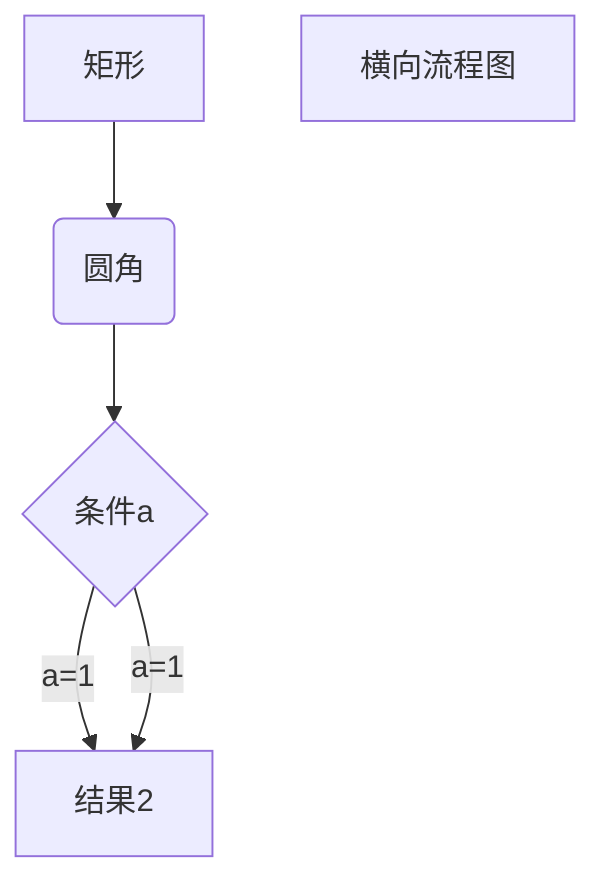

<h1 align =  "center">Typora 使用方法</h1>

<font color='red'>红色</font>

<font color='cornflowerblue'>蓝色</font>

<font color='orange'>橙色</font>


插入表格  CTRL+T

|      |      |      |
| ---- | ---- | ---- |
|      |      |      |
|      |      |      |
|      |      |      |

流程图

```flow
st=>start: Start
op=>operation: content
cond=>condition: sure?
sub1=>subroutine: sub
io=>inputoutput: output
e=>end: end

st->op->cond
cond(yes)->io->e
cond(no)->sub1->op
```

```flow
st=>start: 开始
e=>end: 结束

xmlRead=>operation: 读取xml文件
xmlReadCon=>condition: 资源文件存在?
xmlReadYes=>inputoutput: 资源文件存在
xmlReadNO=>inputoutput: 资源文件不存在

loadResoure=>operation: 加载资源文件
loadResoureCon=>condition: 加载成功?
loadResoureYes=>inputoutput: 资源文件加载成功
loadResoureNo=>inputoutput: 资源文件加载失败

st->xmlRead->xmlReadCon
xmlReadCon(yes,right)->xmlReadYes
xmlReadCon(no,left)->xmlReadNO

xmlReadYes->loadResoure->loadResoureCon
loadResoureCon(yes,right)->loadResoureYes->e
loadResoureCon(no,left)->loadResoureNo
```


横向流程图





纵向流程图




